# High-Impact CS Project Ideas (Student Edition)

Updated stats: 46+ markdown guides and templates.

A curated list of practical software project ideas focused on real student and campus problems.

## At a Glance

| What you need | Go here |
|---|---|
| Complete guide map | [guides/COMPLETE_CS_GUIDE_INDEX.md](guides/COMPLETE_CS_GUIDE_INDEX.md) |
| Platform-wise resources | [guides/platforms/PLATFORMS_INDEX.md](guides/platforms/PLATFORMS_INDEX.md) |
| FAST-specific guidance | [guides/fast-university/FAST_UNIVERSITY_INDEX.md](guides/fast-university/FAST_UNIVERSITY_INDEX.md) |
| One-page onboarding | [START_HERE.md](START_HERE.md) |
| Goal-based guide selector | [GUIDE_SELECTION_MATRIX.md](GUIDE_SELECTION_MATRIX.md) |
| Link verification rules | [guides/fast-university/FAST_LINK_VERIFICATION_GUIDE.md](guides/fast-university/FAST_LINK_VERIFICATION_GUIDE.md) |
| One-month execution plan | [guides/14-30-DAY-GROWTH-PLAN.md](guides/14-30-DAY-GROWTH-PLAN.md) |

## Architecture Map

```mermaid
flowchart TD
	A[START_HERE.md] --> B[Core Guides]
	A --> C[FAST Hub]
	A --> D[Graduate and Job Path]
	A --> E[AI Learning Path]

	B --> B1[guides/01-CS-FOUNDATIONS.md]
	B --> B2[guides/03-WEB-DEVELOPMENT.md]
	B --> B3[guides/14-30-DAY-GROWTH-PLAN.md]

	C --> C1[guides/fast-university/FAST_UNIVERSITY_INDEX.md]
	C1 --> C2[Applicants]
	C1 --> C3[Current Students]
	C1 --> C4[Graduates]

	D --> D1[guides/04-DSA.md]
	D --> D2[guides/06-SYSTEM-DESIGN.md]
	D --> D3[guides/09-CAREER-RESUME-INTERVIEW.md]
	D --> D4[OUTCOMES.md]

	E --> E1[guides/10-AI-TOOLS.md]
	E --> E2[guides/11-AI-CODING-WORKFLOW.md]
	E --> E3[guides/13-AI-ETHICS.md]

	F[Platform Hub] --> F1[guides/platforms/PLATFORMS_INDEX.md]
	F1 --> F2[GitHub Repos]
	F1 --> F3[MOOCs]
	F1 --> F4[YouTube]
	F1 --> F5[Interview Platforms]

	G[Navigation Aids] --> G1[GUIDE_SELECTION_MATRIX.md]
	G --> G2[FAQ.md]
	G --> G3[SIMILAR_PROFILES_AND_REFERENCES.md]
	G --> G4[CONTRIBUTOR_SPOTLIGHTS.md]
```

## Choose Your Path by Role

| Role | Best starting files |
|---|---|
| Beginner CS student | [guides/01-CS-FOUNDATIONS.md](guides/01-CS-FOUNDATIONS.md), [guides/03-WEB-DEVELOPMENT.md](guides/03-WEB-DEVELOPMENT.md) |
| FAST applicant | [guides/fast-university/FAST_APPLICANTS_GUIDE.md](guides/fast-university/FAST_APPLICANTS_GUIDE.md) |
| Current FAST student | [guides/fast-university/FAST_CURRENT_STUDENTS_GUIDE.md](guides/fast-university/FAST_CURRENT_STUDENTS_GUIDE.md) |
| FAST graduate/job seeker | [guides/fast-university/FAST_GRADUATES_GUIDE.md](guides/fast-university/FAST_GRADUATES_GUIDE.md), [guides/09-CAREER-RESUME-INTERVIEW.md](guides/09-CAREER-RESUME-INTERVIEW.md) |
| Interview prep learner | [guides/04-DSA.md](guides/04-DSA.md), [guides/06-SYSTEM-DESIGN.md](guides/06-SYSTEM-DESIGN.md) |
| AI-assisted learner | [guides/10-AI-TOOLS.md](guides/10-AI-TOOLS.md), [guides/11-AI-CODING-WORKFLOW.md](guides/11-AI-CODING-WORKFLOW.md), [guides/13-AI-ETHICS.md](guides/13-AI-ETHICS.md) |

## Quick Start Paths

- Beginner path: [guides/01-CS-FOUNDATIONS.md](guides/01-CS-FOUNDATIONS.md) -> [guides/03-WEB-DEVELOPMENT.md](guides/03-WEB-DEVELOPMENT.md) -> [guides/14-30-DAY-GROWTH-PLAN.md](guides/14-30-DAY-GROWTH-PLAN.md)
- FAST student path: [guides/fast-university/FAST_UNIVERSITY_INDEX.md](guides/fast-university/FAST_UNIVERSITY_INDEX.md)
- Interview path: [guides/04-DSA.md](guides/04-DSA.md) -> [guides/06-SYSTEM-DESIGN.md](guides/06-SYSTEM-DESIGN.md) -> [guides/09-CAREER-RESUME-INTERVIEW.md](guides/09-CAREER-RESUME-INTERVIEW.md)
- AI-assisted learning path: [guides/10-AI-TOOLS.md](guides/10-AI-TOOLS.md) -> [guides/11-AI-CODING-WORKFLOW.md](guides/11-AI-CODING-WORKFLOW.md) -> [guides/13-AI-ETHICS.md](guides/13-AI-ETHICS.md)
- Free courses and certification path: [guides/19-FREE-COURSES-AND-CERTIFICATIONS.md](guides/19-FREE-COURSES-AND-CERTIFICATIONS.md) -> [guides/platforms/MOOCS_AND_STRUCTURED_COURSES.md](guides/platforms/MOOCS_AND_STRUCTURED_COURSES.md) -> [guides/16-SCHOLARSHIPS-AND-BENEFITS.md](guides/16-SCHOLARSHIPS-AND-BENEFITS.md)

## Why This Repository

Most project idea lists are generic or repeated.
This repository focuses on:
- real-world pain points
- practical MVP scope
- social and academic impact
- portfolio-ready implementation paths

Note: No idea can be guaranteed as "never done before", but these are underserved and can be made unique with local context, language support, and strong execution.

## Extended Documentation

- One-page onboarding: [START_HERE.md](START_HERE.md)
- Guide selection matrix: [GUIDE_SELECTION_MATRIX.md](GUIDE_SELECTION_MATRIX.md)
- FAQ: [FAQ.md](FAQ.md)
- 30/60/90 outcomes: [OUTCOMES.md](OUTCOMES.md)
- Similar profiles and references: [SIMILAR_PROFILES_AND_REFERENCES.md](SIMILAR_PROFILES_AND_REFERENCES.md)
- Contributor spotlights: [CONTRIBUTOR_SPOTLIGHTS.md](CONTRIBUTOR_SPOTLIGHTS.md)
- Complete separate guides index: [guides/COMPLETE_CS_GUIDE_INDEX.md](guides/COMPLETE_CS_GUIDE_INDEX.md)
- Platform-wise learning resources hub: [guides/platforms/PLATFORMS_INDEX.md](guides/platforms/PLATFORMS_INDEX.md)
- Cybersecurity platform guide: [guides/platforms/ETHICAL_HACKING_AND_CYBERSECURITY.md](guides/platforms/ETHICAL_HACKING_AND_CYBERSECURITY.md)
- Graphic design and editing guide: [guides/platforms/DESIGN_AND_EDITING_PLATFORMS.md](guides/platforms/DESIGN_AND_EDITING_PLATFORMS.md)
- Free certification paths: [guides/platforms/FREE_CERTIFICATION_PATHS.md](guides/platforms/FREE_CERTIFICATION_PATHS.md)
- FAST University detailed student and graduate hub: [guides/fast-university/FAST_UNIVERSITY_INDEX.md](guides/fast-university/FAST_UNIVERSITY_INDEX.md)
- FAST link verification guide: [guides/fast-university/FAST_LINK_VERIFICATION_GUIDE.md](guides/fast-university/FAST_LINK_VERIFICATION_GUIDE.md)
- Extended student handbook: [STUDENT_RESOURCE_GUIDE_EXTENDED.md](STUDENT_RESOURCE_GUIDE_EXTENDED.md)
- Free courses and certifications guide: [guides/19-FREE-COURSES-AND-CERTIFICATIONS.md](guides/19-FREE-COURSES-AND-CERTIFICATIONS.md)
- Quick links index: [PLATFORMS_AND_RESOURCES_INDEX.md](PLATFORMS_AND_RESOURCES_INDEX.md)
- Idea contribution format: [PROJECT_TEMPLATE.md](PROJECT_TEMPLATE.md)
- Link maintenance tracker: [LAST_VERIFIED.md](LAST_VERIFIED.md)
- Change history: [CHANGELOG.md](CHANGELOG.md)

## 1. University Deadline Aggregator

### Problem
Students miss assignments and quizzes because deadlines are scattered across LMS, chats, and emails.

### MVP
- Add courses and deadlines manually
- Weekly calendar view
- Smart reminders (24h, 6h, 1h before due)
- Priority tags (quiz, assignment, lab)

### Tech
React + Node.js + Express + MongoDB

### Impact
Improves academic consistency and reduces missed submissions.

## 2. Lecture-to-Revision Generator (Urdu + English)

### Problem
Students have long notes but no concise revision material.

### MVP
- Paste/upload notes
- Generate topic-wise summary
- Generate 10 MCQs automatically
- Export revision sheet as PDF

### Tech
Node.js + Python NLP service + React

### Impact
Saves revision time and helps exam preparation.

## 3. Internship Readiness Tracker

### Problem
Students do not know whether they are job-ready.

### MVP
- Skill checklist (frontend/backend/DSA/system design)
- Weekly progress tracker
- Gap analysis and next-step suggestions
- Resume and GitHub checklist

### Tech
Next.js + PostgreSQL

### Impact
Provides a structured path to internships and entry-level roles.

## 4. FYP Team Contribution Auditor

### Problem
Final-year project teams often struggle with accountability and uneven contribution.

### MVP
- Team task board
- Contribution log per member
- Weekly supervisor report export
- Deadline risk alerts

### Tech
MERN stack + role-based auth

### Impact
Improves team fairness and project delivery quality.

## 5. Scholarship Finder (Pakistan Focus)

### Problem
Scholarship opportunities are fragmented and hard to verify.

### MVP
- Scholarship listing with source links
- Eligibility filters
- Deadline reminders
- Bookmark and apply tracker

### Tech
Node.js + Express + MongoDB + crawler/scraper jobs

### Impact
Helps students access funding opportunities more efficiently.

## 6. Student Budget + Stress Insight Tracker

### Problem
Financial stress affects academic performance, but students rarely track both together.

### MVP
- Daily expense + mood + study-time logging
- Trend visualization
- Risk alerts for burnout patterns
- Weekly personal report

### Tech
React + Firebase or Supabase

### Impact
Encourages healthier study and spending habits.

## 7. Campus Complaint Intelligence Dashboard

### Problem
Complaints are submitted, but trend insights are not visible for action.

### MVP
- Anonymous complaint form
- Category and severity tags
- Trend dashboard by month
- Department-wise insights

### Tech
Node.js + PostgreSQL + charting library

### Impact
Improves campus transparency and issue resolution.

## 8. Beginner Code Feedback Assistant

### Problem
Beginners get answers, but not structured feedback on code quality.

### MVP
- Paste code and receive rubric score
- Checks: readability, structure, naming, edge-case handling
- Suggested refactor points
- Improvement history

### Tech
Node.js + static analysis tools + rule engine

### Impact
Improves learning quality, not just solution output.

## Suggested Build Order

1. University Deadline Aggregator
2. Internship Readiness Tracker
3. Lecture-to-Revision Generator
4. FYP Team Contribution Auditor
5. Scholarship Finder

## How To Use This Repo

1. Pick one project idea.
2. Define problem statement for your local context.
3. Build MVP in 2-4 weeks.
4. Add docs, screenshots, and demo video.
5. Publish and iterate with feedback.

## Contributing

Contributions are welcome:
- new high-impact ideas
- better MVP scope definitions
- implementation guides
- sample architecture diagrams

Before sharing new resources, please check:
- [LAST_VERIFIED.md](LAST_VERIFIED.md)
- [guides/fast-university/FAST_LINK_VERIFICATION_GUIDE.md](guides/fast-university/FAST_LINK_VERIFICATION_GUIDE.md)
